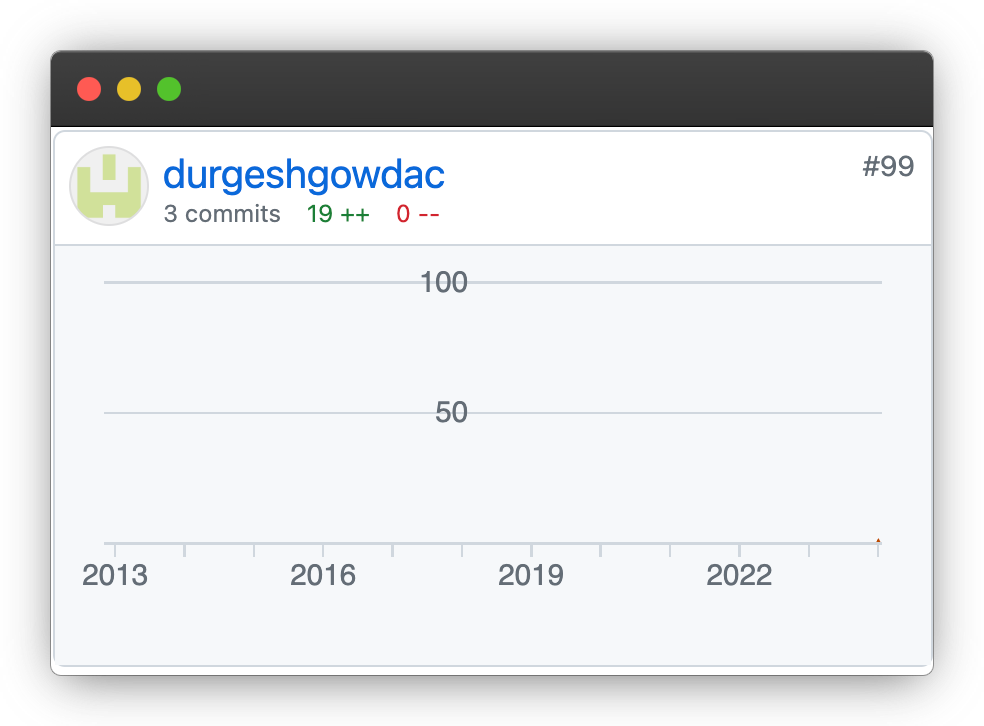

  

<h1>Hi, I'm Durgesh Gowda 👋</h1>

<!---

-->

<!-- contact badges -->

  
  
  
  
  
  
  

<!-- About Me --->
## > About me:
My name is Durgesh Gowda C (he, him), and I am a self-taught Java developer, with a variety of interests and experiences; I enjoy learning about anything and everything!

You will often find me working on, or writing about:
- Machine Learning Projects
- Deep Learning Projects
- Java Projects
- Mobile Application Development (Android Studio)
- Python Projects
- MySQL Projects

<!-- Education -->
## > Education:
### B.Tech - Presidency University (2019 - 2023)
- Computer Engineering (Data Science)
- CGPA (10 points): **9.19 (87.30%)**
- GPA  (4 points) : **3.73**
- Was part of Google Developer Student Club (GDSC), Microsoft Learn Student Ambassadors (MLSA), Science Club, and CodeChef Community.

## > Experience:
### Project intern at the Indian Space Research Organisation (ISRO)

**Duration:** February 2023 - July 2023 **(6 months)**

**Project Topic:** Satellite data processing, retrieval, and visualization using NLP and AI techniques.

- Developed a cross-platform (Windows, Mac, or Linux) application for retrieving and visualizing real-time data.
- Worked with ISRO's servers to retrieve real-time data.
- Integrated ISRO's servers with command-based (voice or text) retrieval systems to automate workflow (real-time retrieval and plotting).
- Real-time voice transcription was done using **OpenAI's Whisper**.
- Fine-tuned **RoBERTa** for satellite instruments and domain NER using data augmentation, **NLP-assisted annotation**, and machine learning approaches.
- Built a semantic search engine leveraging **Whoosh** and **SpaCy** for a flexible data retrieval system.
- Built and incorporated a real-time data visualization tool with the NLP system and a robust application for automated data processing pipelines, visualizations, and GUI assisted by OpenAI's Whisper for seamless speech-to-text.
- Deployed in the mission control center, improving data retrieval and visualization tasks by up to 8x.

---

### Open Source Contributor - [simpleicons.org](https://simpleicons.org/)

**Duration:** December 2023 - present

  

• Added 3 new icons - Hyperskill, Asahi Linux, Magic 

• Updated simple-icons/_data/simple-icons.json

 - [Hyperskill](https://simpleicons.org/icons/hyperskill.svg)
 - [Magic](https://simpleicons.org/icons/magic.svg)
 - [Asahi Linux](https://simpleicons.org/icons/asahilinux.svg)
 

## > GitHub Contributions:

  
   

  <!-- github-contributions snake -->
  
  
   
  
  <!-- github-activity graph -->
  
   

  
<h3>GitHub Stats</h3>

  

    <!-- github-profile details -->
    
     
    <!-- github-profile stats and commit timeline -->
    
    
     
    <!-- github 3d contribution stats -->
    
    
     
    <!-- github languages -->
    
    
  

## > GitHub Gists:

  

## > LeetCode Stats:

<!--- Leetcode solved, contest rating, ranking (shield.io) badges-->

  
  
  &nbsp;&nbsp;&nbsp;&nbsp;&nbsp;&nbsp;&nbsp;&nbsp;
  
  &nbsp;&nbsp;&nbsp;&nbsp;&nbsp;&nbsp;&nbsp;&nbsp;
  
  &nbsp;&nbsp;&nbsp;&nbsp;&nbsp;&nbsp;&nbsp;&nbsp;

<!-- Leetcode Badges

-->

<!--Rating

  

-->

  
<h3>Leetcode Daily Medals</h3>

  <table>
    <tr>
      <th></th>
    </tr>
    <tr>
      <td>January 2024</td>
    </tr>
    <tr>
      <td>01-31-2024</td>
    </tr>
  </table>
  
  <table>
    <tr>
      <th></th>
      <th></th>
      <th></th>
      <th></th>
      <th></th>
    </tr>
    <tr>
      <td>December 2023</td>
      <td>November 2023</td>
      <td>October 2023</td>
      <td>September 2023</td>
      <td>August 2023</td>
    </tr>
    <tr>
      <td>12-31-2023</td>
      <td>11-30-2023</td>
      <td>10-31-2023</td>
      <td>09-30-2023</td>
      <td>08-31-2023</td>
    </tr>
  </table>

  
<h3>Leetcode Annual Medals</h3>

  <table>
    <tr>
      <th></th>
      <th></th>
    </tr>
    <tr>
      <td>50 Days Badge</td>
      <td>100 Days Badge</td>
    </tr>
    <tr>
      <td>12-15-2023</td>
      <td>12-15-2023</td>
    </tr>
  </table>

<!--Languages and Tools Section-->       
<h2>Lᴀɴɢᴜᴀɢᴇs ᴀɴᴅ Tᴏᴏʟs</h2>

<!-- Java - Spring -->

  

<!-- Python -->

  

<!-- Databases -->

  

<!-- OS -->

  

<!-- git -->

  

<!-- FrontEnd -->

  

<!-- Other Languages -->

  

<!-- Connect --> 
## Connect with me:

  
  
  
  
  
  

## Final Words

Thank you very much for reading until here 😊

If you like this README, feel free to fork the repo for your reference. Of course, give proper credits to the contributors who made this possible.

Have a blast! 🚀

 

