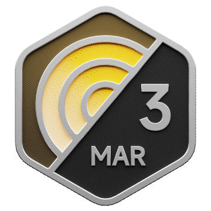
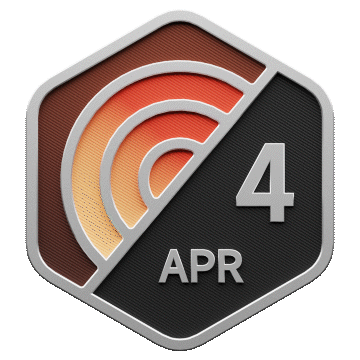
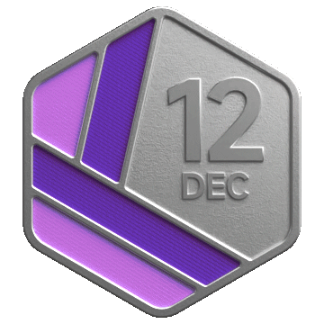
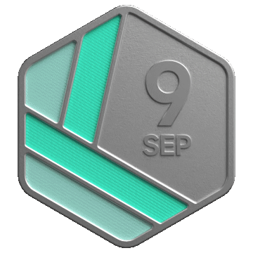
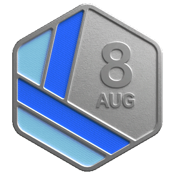
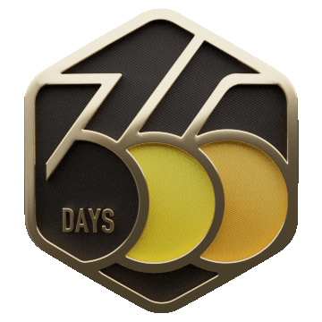
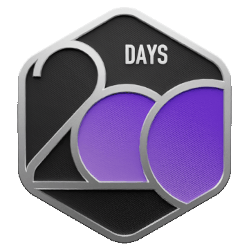
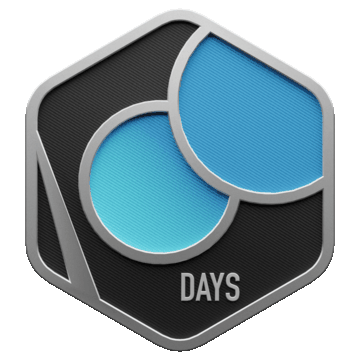
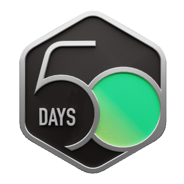
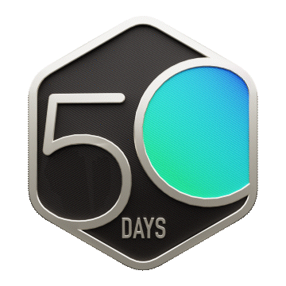

# Hey, I'm Durgesh 👋

<!-- contact badges -->

  
  &nbsp;
  
  &nbsp;
  
  &nbsp;
  
  &nbsp;
  
  &nbsp;
  
  

I'm an AI/ML Engineer based in Bengaluru. I recently completed my **MTech in Machine Intelligence** at PES University (CGPA: 9.41, **Prof. CNR Rao Scholar**), and I build production AI systems — the kind that run in mission-critical environments, not just notebooks.

Most recently, I interned at the **Indian Navy's AI Incubation Centre (INICAI)**, where I built a real-time multi-camera person re-identification system using NVIDIA DeepStream. Before that, I spent six months at **ISRO (ISTRAC)** engineering an NLP pipeline that gave scientists 10x faster access to satellite telemetry data.

## What drives me

I'm drawn to the gap between AI research and real-world deployment. There's a version of machine learning that lives in papers and a very different version that has to survive noisy sensor feeds, mission-critical uptime requirements, and engineers who need answers in milliseconds. **That gap is where I want to work.**

At ISRO, I saw how domain experts couldn't access their own data quickly enough — I fixed it with NLP. At INICAI, I tackled one of computer vision's hardest problems: tracking a person as they disappear from one camera and reappear in another. These experiences shaped how I think about building AI: reliability and real impact first, elegance second.

Right now I'm exploring the GenAI stack — multimodal RAG, LLMs, and MLOps — and looking for AI Engineer roles where I can bring that production mindset to scale.

## My tech toolbox

Here's the tech I use to bring ideas to life:

- **Languages** — Python, C++, Java, Bash
- **AI / ML / DL** — PyTorch, TensorFlow, HuggingFace Transformers, scikit-learn, OpenCV, FAISS, YOLO
- **GenAI & Cloud AI** — Gemini API, Vertex AI, Multimodal RAG, Google Cloud AI, BigQuery ML
- **Specialties** — Computer Vision, NLP, Deep Learning, Semantic Search, Model Fine-Tuning, NVIDIA DeepStream, CUDA
- **Infrastructure** — Docker, GCP, App Engine
- **Backend & Databases** — FastApi, MySQL, PostgreSQL, MongoDB, SQLite
- **Tools** — Git, GitHub, Postman, Linux

## Experience

**1. Indian Navy — INICAI** (AI/ML Engineer Intern)

**Duration:** October 2025 - December 2025 (3 months)

> Real-Time Multi-Camera Person Tracking and Re-Identification

- Architected and deployed a production-grade real-time multi-camera person Re-ID system using **NVIDIA DeepStream SDK** (Python + C++), integrating object detection, multi-object tracking, and appearance-based Re-ID into a single low-latency GStreamer inference.
- Designed a multi-stage identity resolution pipeline maintaining consistent global IDs across camera handoffs, occlusions, and re-entries with robust distance aggregation.

**2. ISRO — ISTRAC** (AI/ML Project Intern)

**Duration:** February 2023 - July 2023 (6 months)

> Satellite Data Retrieval, Processing & Visualization using NLP and AI

- Fine-tuned **RoBERTa** for domain-specific NER on satellite mission vocabulary; integrated **OpenAI Whisper** for voice command support — giving scientists a natural language interface to ISRO's operational servers.
- Built a semantic search engine (Whoosh + SpaCy) that replaced keyword-only lookup and improved retrieval speed **10x**. Delivered as a production Tkinter desktop application inside ISRO's live environment.

**3. Simple Icons** (Open Source Contributor) [View contributions →](https://github.com/simple-icons/simple-icons/commits?author=durgeshgowdac)

**Duration:** Jan 2024 - present

- Contributed brand icons to a globally used open-source icon library. Maintained JSON schema compliance via standard GitHub PR workflows.

## Projects I'm proud of

Check out some of my work:

- **[FoundYou](https://github.com/durgeshgowdac/foundyou)** — Multi-camera person Re-ID with FAISS-accelerated three-stage identity matching, YOLO + ByteTrack + OSNet-512. Handles occlusions, re-entries, and cross-camera ID linking with minimal false positives.
- **[SAMS](https://github.com/durgeshgowdac/Student-Attendance-Management-System)** — Full-stack Django attendance management system with role-based access (admin, teacher, student), dashboards, and reporting across institutions.
- **[Newton-Gravity](https://github.com/durgeshgowdac/Newton-Gravity)** — Real-time 3D gravitational physics simulation in C++ and OpenGL with custom physics logic and interactive camera controls.
- **[AVL Tree Visualizer](https://github.com/durgeshgowdac/avl-tree-visualization)** — Interactive Java/Swing GUI for step-by-step AVL tree operations with controllable animation speed, built as an educational tool.
- **[ArtAttack](https://github.com/durgeshgowdac/ArtAttack)** — First-person 3D art gallery game in Unity with custom ShaderLab paint shaders, physics-based brush mechanics, security AI, and localization support.

(Explore the repos for code and details!)

<a href="https://github.com/durgeshgowdac">
  <picture>
    <source media="(prefers-color-scheme: dark)" srcset="https://github.com/durgeshgowdac/durgeshgowdac/raw/output/ocean.svg">
    <source media="(prefers-color-scheme: light)" srcset="https://github.com/durgeshgowdac/durgeshgowdac/raw/output/github-snake.svg">
    
  </picture>
</a>

## Hackathons & Competitions

| Event                                                                       | Project                                                      | Role      | Result                                |
| --------------------------------------------------------------------------- | ------------------------------------------------------------ | --------- | ------------------------------------- |
| **CIDECODE Cyber Hackathon** — Karnataka Police CID × PES University (2025) | NoFakeAI (deepfake detection system)                         | Team Lead | **6th / 341 teams** Top 40 nationally |
| **TexPedition Hackathon** — Epsilon x Hack2Skill (2025)                     | AdComply (Advertisement Compliance system)                   | Team Lead | Finalists                             |
| Smart India Hackathon — Ministry of Education (2025)                        | FixMyNagara (Civic lssue Reporting and Resolution System) | Team Lead | Selected                              |
| **Tata Elxsi TELIPORT Season 3**                                            | Mentored Team **"Code Bunnies"**                             | Mentor    | -                                     |

## Let's connect

Always happy to talk about AI, LLMs, RAG, AI agents, cool side projects, or the mysterious bugs that somehow disappear the moment you start debugging them.

- LinkedIn: [durgeshgowdac](https://www.linkedin.com/in/durgeshgowdac/)
- Github: You're here! Star a repo if something catches your eye.

<h2>Little Inspiration</h2>

> “First solve the problem. Then optimize it.” — Ken Thompson

Thanks for stopping by! 🚀

---

  
<h3>Miscellaneous [Click]</h3>

<h2>Profile Summary</h2>

- 🎓 **MTech Computer Science (Machine Intelligence)** — PES University · CGPA 9.41 · Prof. CNR Rao Scholar
- 🎓 **BTech Computer Engineering (Data Science)** — Presidency University · CGPA 9.19
- 🛰️ AI/ML Intern — ISRO ISTRAC & Indian Navy INICAI
- ☁️ Google Skills **Diamond League** — 84,700 pts · Gemini, Multimodal RAG, MLOps on Vertex AI, Terraform, Kubernetes
- 🏆 National hackathon finalist — 6th out of 341 teams (CIDECODE × Karnataka Police CID) · Selected for SIH 2025
- 💡 Mentored Team "Code Bunnies" at Tata Elxsi TELIPORT Season 3
- 💻 600+ LeetCode problems · 3,800+ Hyperskill problems · Open-source contributor to Simple Icons

<h2>Education</h2>
<h3></h3>M.Tech - Presidency University (2024 - 2026)</h3>

- Computer Science Engineering (Machine Intelligence - Machine Learning + Artificial Intelligence)
- **Prof. CNR Rao Scholar**
- CGPA (10 points) : **9.41 (89.39 %)**
- GPA  (4 points) : **3.76**
- UK Equivalent : First-Class Honours (1st) / Distinction
- Participated in CIDECODE, TeXpedition, Smart India Hackathon (SIH), mentored in Tata Elxsi Hackathon (season 3)
- Attended Guidewire DEVSummit 2025, and worked as Invigilation Teaching Assistant

<h3>B.Tech - Presidency University (2019 - 2023)</h3>

- Computer Engineering (Data Science)
- CGPA (10 points): **9.19 (87.30 %)**
- GPA  (4 points) : **3.68**
- UK Equivalent : First-Class Honours (1st) / Distinction
- Was part of Google Developer Student Club (GDSC), Microsoft Learn Student Ambassadors (MLSA), Science Club, and CodeChef Community.

<h2>Google Cloud — Skills & Certifications</h2>

**Generative AI & LLMs**
- Develop Gen AI Apps with Gemini and Streamlit
- Build Real World AI Applications with Gemini and Imagen
- Inspect Rich Documents with Gemini Multimodality and Multimodal RAG
- Explore Generative AI in Agent Platform · Prompt Design in Agent Platform
- Introduction to Generative AI · Introduction to Large Language Models
- Conversational AI on Vertex AI and Dialogflow CX
- Responsible AI: Applying AI Principles with Google Cloud

**MLOps & Machine Learning**
- Machine Learning Operations (MLOps) with Vertex AI: Model Evaluation
- Certification Study Guide: Professional Machine Learning Engineer (PMLE)
- Perform Predictive Data Analysis in BigQuery · Analyze Sentiment with Natural Language API
- Use Machine Learning APIs on Google Cloud · Engineer Data for Predictive Modeling with BigQuery ML

**Cloud Infrastructure & DevOps**
- Build Infrastructure with Terraform on Google Cloud
- Deploy Kubernetes Applications on Google Cloud
- Build a Secure Google Cloud Network · Scaling with Google Cloud Operations
- Monitor Environments with Google Cloud Managed Service for Prometheus
- Build Event-Driven Applications with Eventarc · Google Cloud Essentials

<h2>Github Contributions</h2>
  

    <h3>Github stats</h3>
    
     
    <!-- github-profile details -->
    
     
    <!-- github-profile stats and commit timeline -->
    
    
     
    <!-- github 3d contribution stats -->
    
    
     
    <!-- github languages -->
    
    
  

  <h3>Github Gists</h3>

  

    
  

  <h2>LeetCode Stats:</h2>

  
  &nbsp;&nbsp;&nbsp;&nbsp;&nbsp;&nbsp;&nbsp;&nbsp;
  
  &nbsp;&nbsp;&nbsp;&nbsp;&nbsp;&nbsp;&nbsp;&nbsp;
  
  &nbsp;&nbsp;&nbsp;&nbsp;&nbsp;&nbsp;&nbsp;&nbsp;

  

  <h3>Leetcode Daily Medals</h3>
  
  <table>
    <tr>
      <th></th>
      <th></th>
      <th></th>
      <th></th>
      <th></th>
      <th></th>
      <th></th>
    </tr>
    <tr>
      <td>January 2024</td>
      <td>February 2024</td>
      <td>March 2024</td>
      <td>April 2024</td>
      <td>May 2024</td>
      <td>June 2024</td>
      <td>July 2024</td>
    </tr>
    <tr>
      <td>01-31-2024</td>
      <td>02-29-2024</td>
      <td>03-31-2024</td>
      <td>04-30-2024</td>
      <td>05-31-2024</td>
      <td>06-30-2024</td>
      <td>07-31-2024</td>
    </tr>
  </table>
  
  <table>
    <tr>
      <th></th>
      <th></th>
      <th></th>
      <th></th>
      <th></th>
    </tr>
    <tr>
      <td>December 2023</td>
      <td>November 2023</td>
      <td>October 2023</td>
      <td>September 2023</td>
      <td>August 2023</td>
    </tr>
    <tr>
      <td>12-31-2023</td>
      <td>11-30-2023</td>
      <td>10-31-2023</td>
      <td>09-30-2023</td>
      <td>08-31-2023</td>
    </tr>
  </table>
  
  <h3>Leetcode Annual Medals</h3>
  <table>
    <tr>
      <th></th>
    </tr>
    <tr>
      <td>SUBMITTED CODE ON 365 OR MORE DAYS IN TOTAL</td>
    </tr>
  </table>
  
  <table>
    <tr>
      <th></th>
      <th></th>
      <th></th>
    </tr>
    <tr>
      <td>200 Days Badge</td>
      <td>100 Days Badge</td>
      <td>50 Days Badge</td>
    </tr>
    <tr>
      <td>07-21-2024</td>
      <td>04-10-2024</td>
      <td>02-21-2024</td>
    </tr>
  </table>
  
  <table>
    <tr>
      <th></th>
      <th></th>
    </tr>
    <tr>
      <td>100 Days Badge</td>
      <td>50 Days Badge</td>
    </tr>
    <tr>
      <td>12-15-2023</td>
      <td>12-15-2023</td>
    </tr>
  </table>

